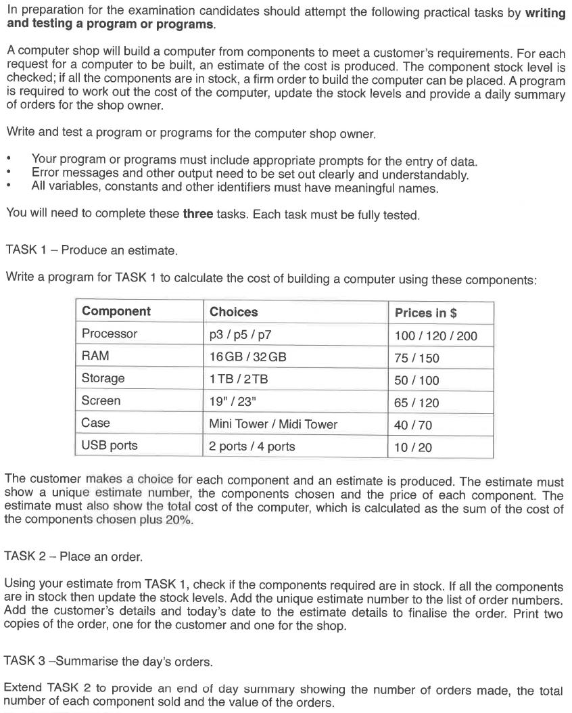

IGCSE PRE-RELEASE MATERIAL
---------------------------
Programs implementing the 2018 IGCSE Pre Release tasks, written in various coding languages/formats, each in their respective folders:
- [Python2.7](python2.7/prerelease.py)
- [C#](C#/prerelease.cs)
- [VB.Net](VB.Net/prerelease.vb)
- [IL](IL/prerelease.il)

Sample Output:
--------------
([python version](python2.7/prerelease.py) output:)
```
Please select your desired processor (1-3):
1) p3 - $100 - 1 in stock.
2) p5 - $120 - 5 in stock.
3) p7 - $200 - 5 in stock.
>1
Please select your desired ram (1-2):
1) 16GB - $75 - 5 in stock.
2) 32GB - $150 - 5 in stock.
>1
Please select your desired storage (1-2):
1) 1TB - $50 - 5 in stock.
2) 2TB - $100 - 5 in stock.
>1
Please select your desired screen (1-2):
1) 19" - $65 - 5 in stock.
2) 23" - $120 - 5 in stock.
>1
Please select your desired case (1-2):
1) Mini Tower - $40 - 5 in stock.
2) Midi Tower - $70 - 5 in stock.
>1
Please select your desired usb ports (1-2):
1) 2 ports - $10 - 5 in stock.
2) 4 ports - $20 - 5 in stock.
>1

Estimation Summary:
Estimation number: 1
processor: p3 - $100
ram: 16GB - $75
storage: 1TB - $50
screen: 19" - $65
case: Mini Tower - $40
usb ports: 2 ports - $10

Estimated total cost: $408.0

Would you like to order this? (y/n)
>y
Please enter your details:
>Bobba
Customer Copy:
Order Summary:
Estimation number: 1
processor: p3 - $100
ram: 16GB - $75
storage: 1TB - $50
screen: 19" - $65
case: Mini Tower - $40
usb ports: 2 ports - $10

Estimated total cost: $408.0
------------------------------
Customer's details: Bobba
Date: 2018-05-10


Shop Copy:
Order Summary:
Estimation number: 1
processor: p3 - $100
ram: 16GB - $75
storage: 1TB - $50
screen: 19" - $65
case: Mini Tower - $40
usb ports: 2 ports - $10

Estimated total cost: $408.0
------------------------------
Customer's details: Bobba
Date: 2018-05-10


Is there another order? (y/n)
>asdsadasd
Please input 'y' for yes and 'n' for no. Please try again
>y
Please select your desired processor (1-3):
1) p3 - $100 - 0 in stock.
2) p5 - $120 - 5 in stock.
3) p7 - $200 - 5 in stock.
>p3
Please input digits only. Please enter a number (1-3). Please try again.
>4
Selection out of range. Please enter a number (1-3). Please try again.
>2
Please select your desired ram (1-2):
1) 16GB - $75 - 4 in stock.
2) 32GB - $150 - 5 in stock.
>2
Please select your desired storage (1-2):
1) 1TB - $50 - 4 in stock.
2) 2TB - $100 - 5 in stock.
>2
Please select your desired screen (1-2):
1) 19" - $65 - 4 in stock.
2) 23" - $120 - 5 in stock.
>2
Please select your desired case (1-2):
1) Mini Tower - $40 - 4 in stock.
2) Midi Tower - $70 - 5 in stock.
>2
Please select your desired usb ports (1-2):
1) 2 ports - $10 - 4 in stock.
2) 4 ports - $20 - 5 in stock.
>2

Estimation Summary:
Estimation number: 2
processor: p5 - $120
ram: 32GB - $150
storage: 2TB - $100
screen: 23" - $120
case: Midi Tower - $70
usb ports: 4 ports - $20

Estimated total cost: $696.0

Would you like to order this? (y/n)
>y
Please enter your details:
>Bibba
Customer Copy:
Order Summary:
Estimation number: 2
processor: p5 - $120
ram: 32GB - $150
storage: 2TB - $100
screen: 23" - $120
case: Midi Tower - $70
usb ports: 4 ports - $20

Estimated total cost: $696.0
------------------------------
Customer's details: Bibba
Date: 2018-05-10


Shop Copy:
Order Summary:
Estimation number: 2
processor: p5 - $120
ram: 32GB - $150
storage: 2TB - $100
screen: 23" - $120
case: Midi Tower - $70
usb ports: 4 ports - $20

Estimated total cost: $696.0
------------------------------
Customer's details: Bibba
Date: 2018-05-10


Is there another order? (y/n)
>n
End of day Summary:
Total orders made: 2
	Order number 1 - $408.0
	Order number 2 - $696.0
Total value of the orders: $1104.0
Total component sales:
	p3: 1
	p5: 1
	p7: 0
	16GB: 1
	32GB: 1
	1TB: 1
	2TB: 1
	19": 1
	23": 1
	Mini Tower: 1
	Midi Tower: 1
	2 ports: 1
	4 ports: 1

```


2018 IGCSE Pre Release tasks:
-----------------------------
